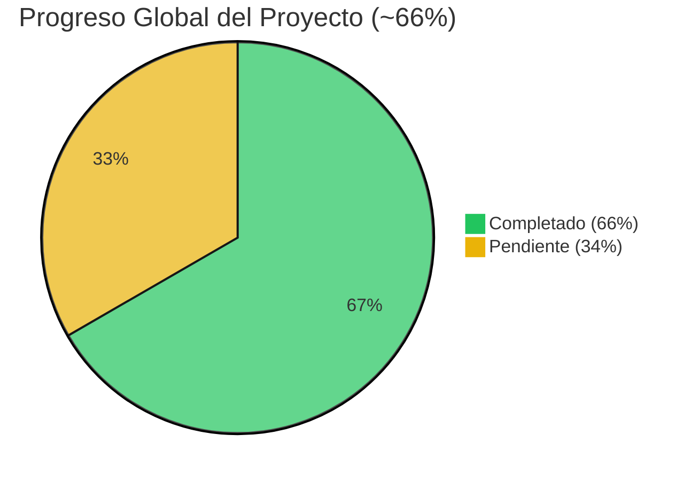
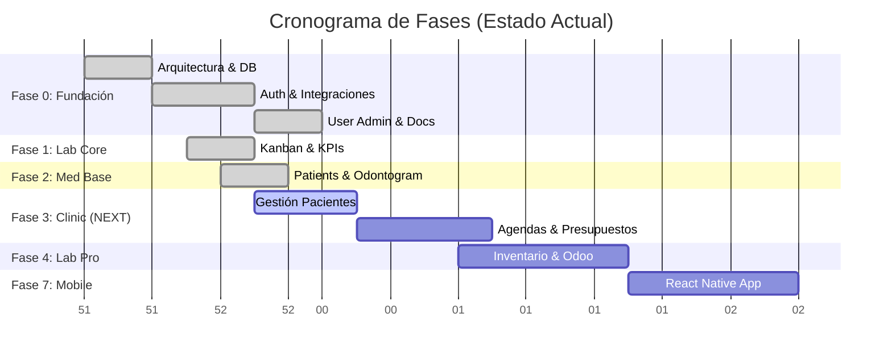
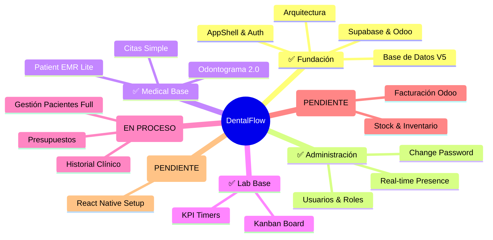

# � VISUAL CHECKLIST - DentalFlow 2026

**Última Actualización:** 2025-12-30
**Versión:** 5.0 (Blueprint 2026)

> **Nota:** Este archivo utiliza gráficos Mermaid. Si no los ves renderizados, instala la extensión "Markdown Preview Mermaid Support" en VS Code o visualízalo en GitHub.

---

## 📈 Tablero de Control

---

## 🗺️ Mapa de Módulos

---

## 📋 Detalle de Tareas

### ✅ Tareas Completadas (La Base Sólida)
*   **Core:** Next.js 15, DB Schemas, RLS Policies.
*   **Auth:** Login/Register, Middleware, Roles.
*   **Integraciones:** Odoo (XML-RPC), Supabase Client.
*   **Admin:** Gestión de usuarios completa (+Pass, +Presence).
*   **Lab:** Tablero Kanban dinámico.
*   **Medical:** Odontograma interactivo.

### � En Progreso (Prioridad Alta)
*   **Clinic Module:** Estamos comenzando la gestión profunda de pacientes.

### � Pendientes (Roadmap)
1.  **Clinic:** Presupuestos (Internos), Calendario avanzado.
2.  **Lab:** Sincronización bidireccional con Odoo.
3.  **Mobile:** App para doctores y técnicos.
4.  **DevOps:** CI/CD y Monitoring avanzado.

---

**Resumen:** Hemos completado toda la infraestructura crítica y los módulos base. Ahora entramos en la fase de lógica de negocio profunda ("Clinic Module").
